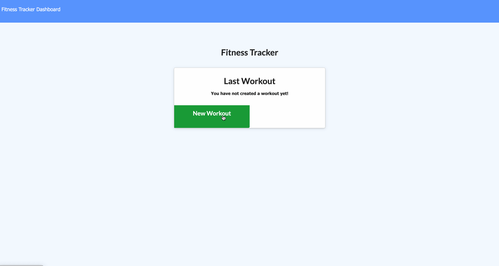

# Fitness Tracker

In this project, I've created a workout tracker where the user can create new workouts and keep a record of their daily exercises. The user can log multiple exercises in a given day. The user can choose between the two exercise types: cardio or resistance and then are presented with different other input fields that the user needs to fill in. For the cardio, you could fill in the name of the exercise, the distance and the time you took completing the exercise and for the resistance, you could set the exercise name, the weight in pounds, number of sets, number of reptitions and the time it took to complete the exercise. The user could keep adding more exercises or click the complete button and should display the last workout data. The user could also check their dashboard to track their progress with the pie charts, line graphs and bar graphs given.

## Table of Contents

* [Technologies Used](#technologies-used)
* [Dependencies Used](#dependencies-used)
* [GIF of Project](#gif-of-project)
* [Code Snippet](#code-snippet)
* [Deployed Link](#deployed-link)
* [Author](#author)
* [License](#license)
* [Acknowledgments](#acknowledgments)

## Technologies Used

* [Node.js](https://nodejs.org/en/)
* [Javascript](https://developer.mozilla.org/en-US/docs/Web/JavaScript)
* [HTML](https://developer.mozilla.org/en-US/docs/Web/HTML)
* [CSS](https://developer.mozilla.org/en-US/docs/Web/CSS)

## Dependencies Used
  
 * [mongoose](https://mongoosejs.com/)
 * [Express.js](https://expressjs.com/)
 * [morgan](https://www.npmjs.com/package/morgan)
 * [mongodb](https://www.mongodb.com/)

## GIF of Project

Here's a GIF of the application.




## Code Snippet

This is a code snippet of our Workout model and its type is an array that will store the exercise data of the user.

```
const mongoose = require("mongoose");
const Schema = mongoose.Schema;
const WorkoutSchema = new Schema({
    exercises: {
        type: Array,
        default: [],
    },
    day: {
        type: Date,
        default: Date.now,
    },
}, {
    toJSON: {
        virtuals: true
    }
});

WorkoutSchema.virtual("totalDuration").get(function() {
    return this.exercises.reduce(function(total, exercise) {
        return total + exercise.duration;
    }, 0);
});

const Workout = mongoose.model("workout", WorkoutSchema);

module.exports = Workout;
```

## Deployed Link
- [See Live Site](https://mighty-tor-92805.herokuapp.com/)

## Author

* Janessa Reeanne Fong

- [Link to Github](https://github.com/janessaref)
- [Link to LinkedIn](https://www.linkedin.com/in/janessafong)
- [Link to Portfolio](https://janessaref.github.io/my-portfolio/)

## License

This project is licensed under the MIT License 

## Acknowledgments

* I'd like to acknowledge my tutor Andrew Knapp.
* To my mentors and instructors, Jerome Chenette, Kerwin Hy, and Manuel Nunes for helping and teaching me throughout this program.
